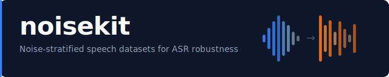
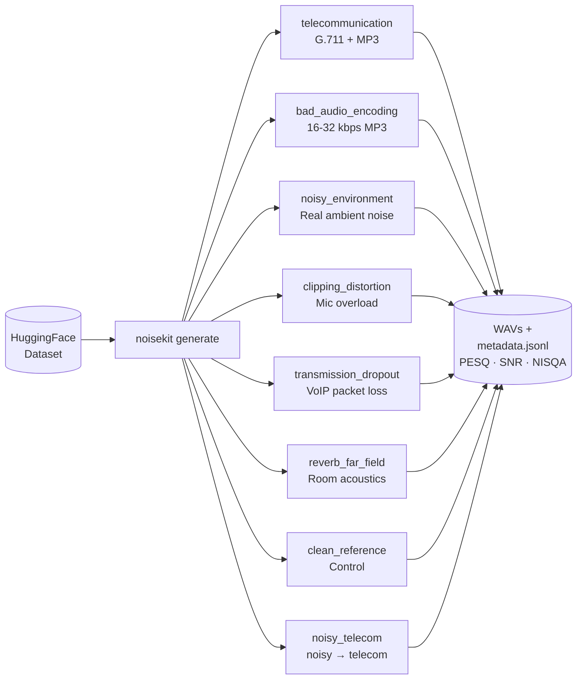

<div align="center">
  

[](https://www.python.org/downloads/)
[](LICENSE)
[](https://github.com/astral-sh/uv)
[](https://github.com/iver56/audiomentations)

</div>

<br/>

Generate noisy speech datasets for ASR benchmark studies.

Takes a clean speech-to-text dataset from HuggingFace, applies real-world degradation presets via [audiomentations](https://github.com/iver56/audiomentations), and scores each output with PESQ + SNR + NISQA — producing a JSONL manifest ready for noise-robustness benchmarking.

Seven atomic scenarios are covered out of the box: **telecommunication** (G.711 + low-bitrate MP3), **bad audio encoding** (aggressive low-bitrate compression), **noisy environment** (real ambient noise), **clipping distortion** (microphone overload), **transmission dropout** (VoIP packet loss), and **far-field reverb** (room acoustics). Atomic presets can be chained into compound multi-condition scenarios.

## How it works



## Install

No installation needed. Run directly with `uvx`:

```bash
uvx noisekit --help
```

Or install for development:

```bash
git clone https://github.com/Karamouche/noisekit.git
cd noisekit
uv sync
uv run noisekit --help
```

## Usage

### Generate a degraded dataset

```bash
uvx noisekit generate \
  --dataset google/fleurs \
  --config en_us \
  --split test \
  --samples 300 \
  --presets telecommunication bad_audio_encoding \
  --output ./benchmark_dataset \
  --seed 42
```

For `noisy_environment`, supply a directory of real noise WAVs (e.g. [MUSAN](https://www.openslr.org/17/), [DEMAND](https://zenodo.org/record/1227121), or [FSD50K](https://zenodo.org/record/4060432)):

```bash
uvx noisekit generate \
  --dataset google/fleurs --config en_us --split test \
  --samples 300 --presets noisy_environment \
  --noise-dir ~/datasets/musan/noise \
  --output ./benchmark_dataset --seed 42
```

Output:

```
benchmark_dataset/
├── metadata.jsonl          # one entry per generated file (AudioFolder format)
└── audio/
    ├── sample_0000_telecommunication.wav
    ├── sample_0001_bad_audio_encoding.wav
    └── ...
```

The output is directly loadable as a HuggingFace dataset:

```python
from datasets import load_dataset
ds = load_dataset("audiofolder", data_dir="./benchmark_dataset")
```

Each `metadata.jsonl` entry:

```json
{
  "file_name": "audio/sample_0042_telecommunication.wav",
  "source": "common_voice_en_23136613.mp3",
  "dataset": "google/fleurs",
  "language": "en-US",
  "preset": "telecommunication",
  "transcript": "the cat sat on the mat",
  "snr_db": 5.2,
  "pesq_mos": 2.78,
  "nisqa_mos": 2.14,
  "nisqa_noisiness": 1.93,
  "nisqa_discontinuity": 2.41,
  "nisqa_coloration": 1.87,
  "nisqa_loudness": 2.3
}
```

### Score an existing audio folder

```bash
# File stats only (duration, RMS, peak)
uvx noisekit score ./audio_folder --output scores.json

# With PESQ + SNR (requires matching reference files)
uvx noisekit score ./audio_folder --reference-dir ./clean_audio --output scores.json

# Skip NISQA (faster, no model download)
uvx noisekit score ./audio_folder --no-nisqa --output scores.json
```

### List available presets

```bash
uvx noisekit list-presets
uvx noisekit list-presets --verbose   # show full transform stack
```

## Presets

Ten built-in presets — seven atomic scenarios plus three compound multi-condition presets plus a clean control. None use synthetic white noise; codec artifacts, real ambient recordings, and room simulation produce the degradation instead.

### Atomic presets

| Preset                 | Description                                                               | PESQ       |
| ---------------------- | ------------------------------------------------------------------------- | ---------- |
| `clean_reference`      | Minimal processing (PESQ ceiling / control)                               | 4.0-4.5    |
| `telecommunication`    | G.711-style call: 8 kHz bandpass + 8-bit BitCrush + 16-32 kbps MP3 codec  | NB 2.0-3.5 |
| `bad_audio_encoding`   | Wideband audio crushed by 16-32 kbps MP3 compression                      | WB 1.5-2.5 |
| `noisy_environment`    | Real ambient noise from `--noise-dir` mixed in at SNR 5-15 dB             | WB 1.0-2.5 |
| `clipping_distortion`  | Microphone overload: clips the loudest 10-25% of samples                  | WB 2.0-3.5 |
| `transmission_dropout` | VoIP packet loss: 1-3 silent dropout windows (60-180 ms each)             | WB 1.5-3.0 |
| `reverb_far_field`     | Far-field room reverb at 1-3 m mic distance (requires `pyroomacoustics`)  | WB 2.0-3.5 |

`telecommunication` is scored with PESQ narrowband at 8 kHz (before the final upsample); all other presets are scored wideband at 16 kHz.

`noisy_environment`, `clipping_distortion`, `transmission_dropout`, and `reverb_far_field` require no noise corpus. The first three need only `audiomentations`; `reverb_far_field` additionally requires `pyroomacoustics`:

```bash
uv add pyroomacoustics
# or as an optional dep:
uvx noisekit[reverb] ...
```

`noisy_environment` requires `--noise-dir` pointing at a directory of background-noise WAVs (e.g. MUSAN, DEMAND, FSD50K). If omitted, noisekit auto-downloads a small MUSAN noise-only subset (~120 MB) from HuggingFace on first use.

### Compound presets

Compound presets chain two atomic presets together. Noise is applied first (acoustic environment), then codec or dropout (digital processing on the already-degraded signal).

| Preset          | Chain                                        | Requires                        | PESQ       |
| --------------- | -------------------------------------------- | ------------------------------- | ---------- |
| `noisy_telecom` | `noisy_environment` → `telecommunication`    | `--noise-dir`                   | NB 1.5-2.5 |
| `dropout_noisy` | `noisy_environment` → `transmission_dropout` | `--noise-dir`                   | WB 1.0-2.0 |
| `reverb_noisy`  | `reverb_far_field` → `noisy_environment`     | `--noise-dir` + pyroomacoustics | WB 1.0-2.5 |

You can also define your own compound preset with a `chain:` key in a YAML file:

```yaml
name: my_compound
description: "Noisy environment then telephony codec"
chain:
  - noisy_environment
  - telecommunication
```

### Custom presets

Pass your own YAML file with `--preset-file`:

```bash
uvx noisekit generate \
  --dataset google/fleurs \
  --samples 100 \
  --preset-file ./my_preset.yaml \
  --output ./output
```

Preset format:

```yaml
name: my_preset
description: "Custom telephony simulation"
transforms:
  - type: Resample
    parameters:
      min_sample_rate: 8000
      max_sample_rate: 8000
    p: 1.0
  - type: Mp3Compression
    parameters:
      min_bitrate: 16
      max_bitrate: 32
      backend: lameenc
    p: 1.0
  - type: Resample
    parameters:
      min_sample_rate: 16000
      max_sample_rate: 16000
    p: 1.0
```

Any transform from [audiomentations](https://github.com/iver56/audiomentations) is supported. Use `${NOISE_DIR}` as a placeholder for `--noise-dir` inside your preset YAML. Use `chain:` instead of `transforms:` to compose built-in atomic presets sequentially.

## Requirements

- Python ≥ 3.10
- [uv](https://docs.astral.sh/uv/) for `uvx` usage
- No system dependencies — MP3 encoding uses pure-Python `lameenc`, no ffmpeg needed
